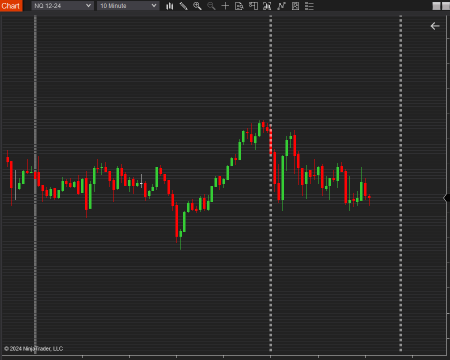
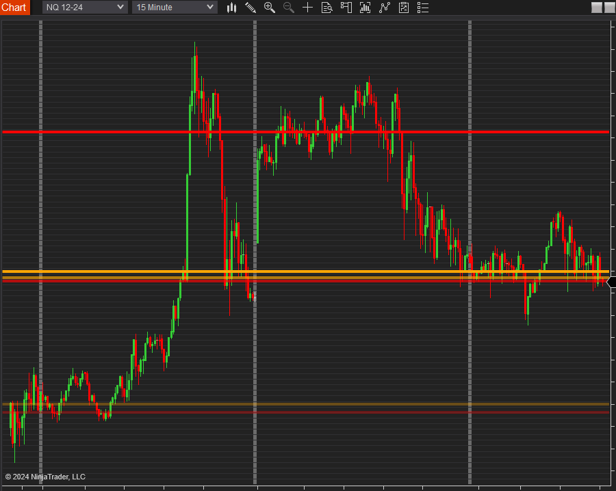
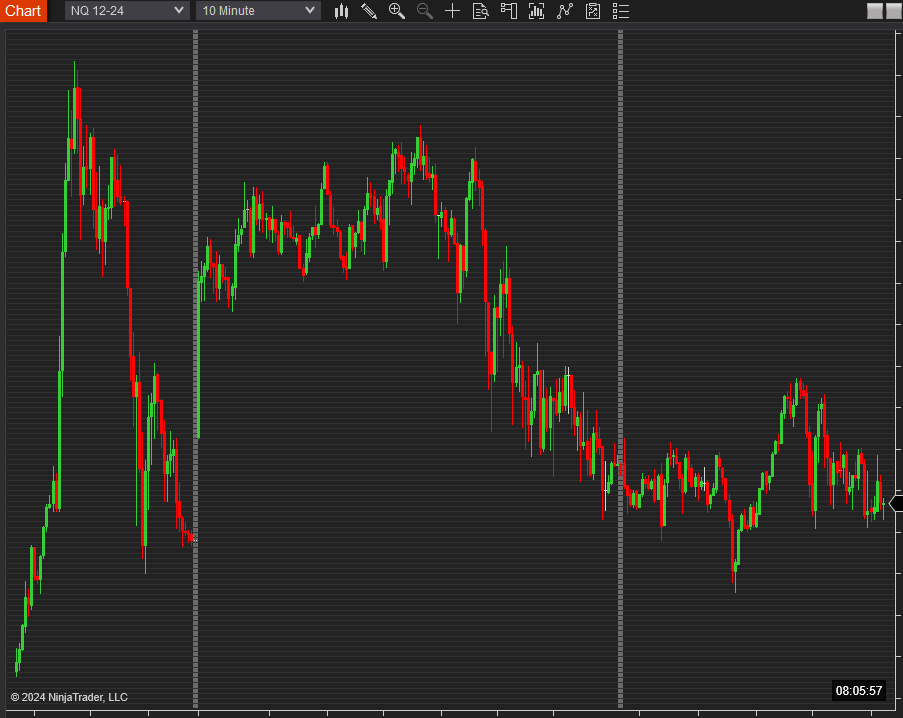
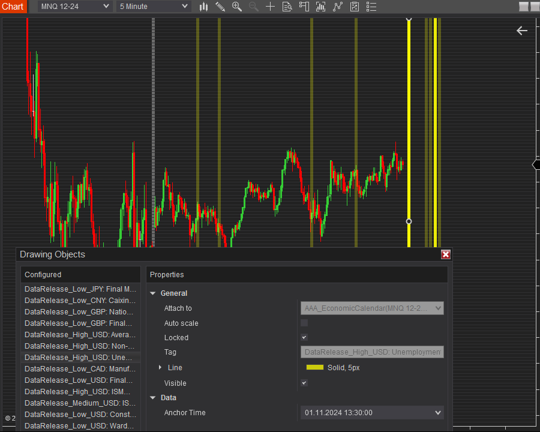

# NinjaTrader Indicators Collection

This repository contains a public subset of custom indicators for NinjaTrader 8 from the AAA collection intended for discretionary trading.

## Indicators Overview

### 1. Session Open Indicator ([AAA_SessionOpen](src/AAA_SessionOpen.cs))
Visualizes market session openings by drawing vertical lines at specified times for both US (NYSE) and European (London) markets.

#### Key Features:
- Configurable session open times for NYSE and London markets
- Timezone-aware calculations
- Customizable line appearance (color, thickness, style, transparency)
- Automatic timezone conversion between markets

### 2. Cash Session Levels ([AAA_CashSessionLevels](src/AAA_CashSessionLevels.cs))
Tracks and displays price levels at session open and close times, helping traders identify key price points and potential support/resistance levels.

#### Key Features:
- Configurable transparency levels for different time periods (up to three recent days)
- Distinct visualization for open and close prices
- Automatic timezone handling

### 3. Clock Indicator ([AAA_Clock](src/AAA_Clock.cs))
Displays the current wall clock time in a specified timezone (by default, EST for NYSE) directly on your chart.

#### Key Features:
- Configurable timezone display
- Adjustable position (top/bottom, left/right)
- Customizable font parameters

### 4. Economic Calendar ([AAA_EconomicCalendar](src/AAA_EconomicCalendar.cs))
Displays economic events from the Forex Factory calendar directly on an instrument chart as vertical line drawings.

#### Key Features:
- Automatic data download from Forex Factory
- Filterable by currency codes and impact levels
- Customizable visualization (color, thickness, style) with different transparency levels for high/medium/low impact events
- Hourly data refresh

## Installation

1. Download the indicator zip from the `packages` subdirectory
2. In NinjaTrader menu navigate to `Tools > Import > NinjaScript Add-On`
3. Point to the indicator zip file
4. The indicator will be available in the Indicators list under the "AAA" prefix
